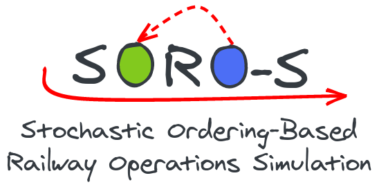

## Developer Setup

To setup SORO-S for developing purposes please follow one of these instructions.

- [Linux Developer Setup (Ubuntu 20.04)](https://github.com/motis-project/soro-s/wiki/Linux-Developer-Setup)
- [Windows Developer Setup (Visual Studio 2022)](https://github.com/motis-project/soro-s/wiki/Windows-Developer-Setup)

## Usage Setup

To simply use SORO-S you can build it yourself you have the following options:

- Building it yourself by following one of the developer setup guides above
- Follow
  the [Docker Container Setup](https://github.com/motis-project/soro-s/wiki/Docker-Container-Usage)
- Use one of the
  supplied [Binaries](https://github.com/motis-project/soro-s/releases)
